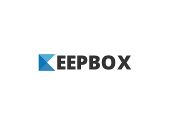

# keepbox-ruby

Keepbox is a simple, secure, and private way to store and share files. It's a great alternative to Dropbox, Google Drive, and other file sharing services.

It syncs files from a local directory to an Amazon S3 bucket. It's a simple Ruby script that uses the AWS SDK for Ruby. Good for individuals and small teams. God bye Dropbox! 👋 🚀 🚀 🚀



## Installation

Clone the repository and run the following commands:

```bash
bundle install
```

And turn keepbox.rb on executable:

```bash
chmod +x keepbox.rb
```

## Configuration

Export AWS credentials as environment variables:

```bash
export AWS_ACCESS_KEY_ID=YOUR_AWS_ACCESS_KEY_ID
export AWS_SECRET_ACCESS_KEY=YOUR_AWS_SECRET_ACCESS_KEY
```
And your bucket name and prefix folder to store files:

```bash
export BUCKET=YOUR_AWS_BUCKET
export PREFIX=YOUR_AWS_PREFIX
```

You can also use `env-example` in the root directory to create a `.env` file with your credentials.

## Run tests

Run the following command to run the tests:

```bash
bundle exec rake test
```

## Usage

Choice a directory to monitor and run keepbox.rb:

```bash
./keepbox.rb /path/to/your/directory
```

And that's it! 🎉 🎉 🎉

## Contributing

Bug reports and pull requests are welcome on GitHub at.

## License

MIT License - see LICENSE.md for details

☕️
